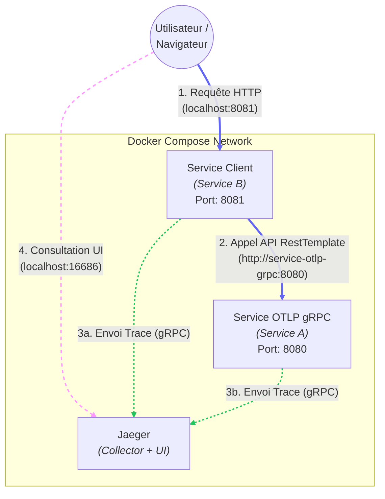

# POC OpenTelemetry avec Spring Boot & Jaeger

POC d'implémentation d'un **Traçage distribué**entre deux microservices Spring Boot en utilisant le protocole **OTLP** via **gRPC**.

## Architecture

* **Service A (service-otlp-grpc)** : API Backend simulée.
* **Service B (service-client)** : Client orchestrateur qui appelle le Service A.
* **Jaeger** : Collecteur et Interface de visualisation des traces.

## Prérequis

* Docker & Docker Compose
* Java 21

## Démarrage rapide

1. Cloner le repository
2. Lancer le script de démarrage (compile et lance Docker) : `./start.sh`

## Accès
| Service |	URL	| Description |
|:---|:---|:---|
| Jaeger UI	| http://localhost:16686 | Visualisation des traces |
| Service Client | http://localhost:8081 | Interface pour générer du trafic |
| Service API | http://localhost:8080 | Backend (Appelé par le client) |

## Architecture
